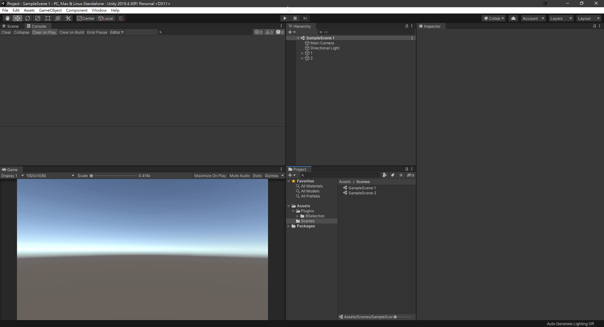

# BSelection

The Unity tool designed for quickly selecting recorded list of objects in the scene.

## Usage

After selecting the objects you want to record, press the save button to store the chosen items for easy retrieval in the future.  
Additionally, you can name the group for the selection to categorize it.

## Demo
---

## Notes
---
* Remember to save your project to save the settings
* It uses the sibling index and the name of the object to find the target
* If the structure of the second scene is similar as the original one, those objects although can be selected